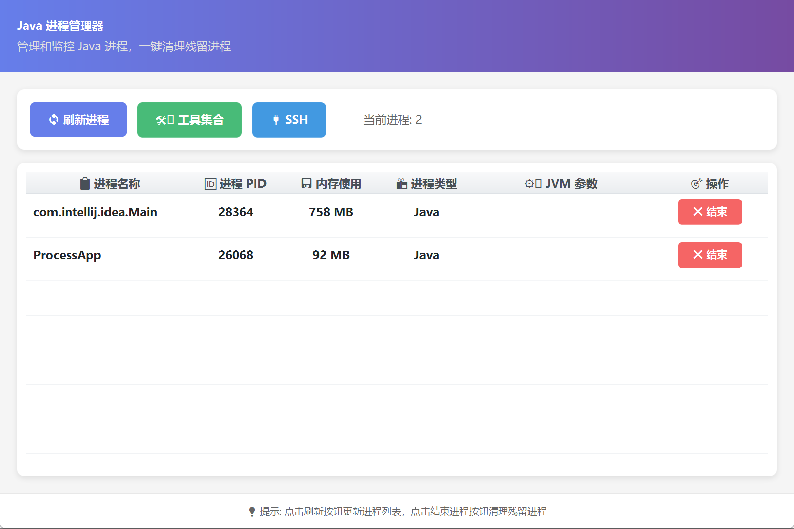

# Process Manager - Java 进程管理器

一款专为 Windows 开发者打造的 Java 进程管理工具，帮助解决 IntelliJ IDEA 等 IDE 崩溃导致的残留进程问题，提供直观的图形化界面和实用的开发工具集。

## ✨ 主要功能

### 📊 进程管理

- **实时查看** - 列出所有运行中的 Java 进程信息
- **详细信息** - 显示进程名称、PID、内存占用等关键数据
- **一键结束** - 快速终止选定的进程
- **智能过滤** - 自动过滤系统进程和无关进程
- **刷新更新** - 实时刷新进程列表

### 🛠️ 开发工具集

- **JSON 格式化** - JSON 数据格式化与验证
- **日期转换器** - 时间戳与日期格式互转
- **Base64 编解码** - Base64 编码解码工具
- **XML 转 JSON** - XML 与 JSON 格式转换
- **文本对比** - 文本内容差异对比

## 🖥️ 技术栈

- **Java 17** - 核心开发语言
- **JavaFX 17** - 桌面图形界面框架
- **Maven** - 项目构建管理
- **Log4j2** - 日志记录
- **Lombok** - 代码简化
- **JUnit 5** - 单元测试
- **Gson / JSON** - JSON 数据处理

## 📦 环境要求

- **操作系统**: Windows (支持 Windows 10/11)
- **Java**: JDK 17 或更高版本
- **Maven**: 3.6+ (开发构建)
- **JavaFX Runtime**: 项目已包含 JavaFX 依赖

## 🚀 快速开始

### 方式一：使用 Maven 运行

```bash
# 克隆项目
git clone <repository-url>
cd processManager

# 使用 Maven 运行
mvn clean javafx:run
```

### 方式二：打包运行

```bash
# 打包项目
mvn clean package

# 运行打包后的 JAR 文件
java -jar target/cleanProcess-1.0-SNAPSHOT-jar-with-dependencies.jar
```

## 📂 项目结构

```
processManager/
├── src/main/
│   ├── java/org/freedom/cleanprocess/
│   │   ├── action/                 # 控制器层
│   │   │   ├── tools/             # 工具集控制器
│   │   │   ├── IndexController.java        # 主页控制器
│   │   │   └── ToolboxController.java      # 工具箱控制器
│   │   ├── component/             # 组件
│   │   │   └── NotificationUtil.java       # 通知工具
│   │   ├── entiy/                 # 实体类
│   │   │   └── ProcessInfo.java            # 进程信息实体
│   │   ├── util/                  # 工具类
│   │   │   └── SceneUtil.java              # 场景切换工具
│   │   ├── ProcessApp.java        # 应用主入口
│   │   └── module-info.java       # 模块配置
│   └── resources/
│       ├── org/freedom/cleanprocess/
│       │   ├── css/              # 样式文件
│       │   ├── fxml/             # FXML 界面文件
│       │   └── logo/             # 图标资源
│       └── log4j2.xml            # 日志配置
├── pom.xml                        # Maven 配置
└── README.md                      # 项目文档
```

## 🎯 使用说明

### 进程管理

1. **查看进程列表**
   - 启动应用后自动加载所有 Java 进程
   - 显示进程名称、PID、内存占用等信息

2. **结束进程**
   - 点击进程对应的「❌ 结束」按钮
   - 确认后立即终止该进程
   - 系统会显示操作结果通知

3. **刷新列表**
   - 点击「🔄 刷新列表」按钮更新进程信息
   - 自动更新进程计数

### 工具集

1. **打开工具箱**
   - 点击主界面的「🛠️ 工具箱」按钮
   - 选择所需工具进入对应页面

2. **返回主页**
   - 在工具页面点击「⬅ 返回」按钮
   - 返回进程管理主界面

## 🔧 开发说明

### 构建配置

项目使用 Maven 进行构建管理，主要插件配置：

- **maven-compiler-plugin**: 编译插件，配置 Java 17
- **maven-assembly-plugin**: 打包插件，生成可执行 JAR
- **javafx-maven-plugin**: JavaFX 运行与构建支持

### 日志配置

使用 Log4j2 进行日志管理，配置文件位于 `src/main/resources/log4j2.xml`

### 样式定制

自定义样式文件位于 `src/main/resources/org/freedom/cleanprocess/css/styles.css`

## 📝 核心功能实现

### 进程信息获取

- 使用 `jps -l` 命令获取 Java 进程列表
- 使用 `jstat -gc` 命令获取内存占用信息
- 动态解析命令输出并展示

### 进程终止

- 使用 Windows `taskkill /F /PID` 命令强制结束进程
- 提供操作结果反馈和错误处理

### 界面交互

- 基于 JavaFX TableView 展示进程列表
- 自定义 TableCell 实现操作按钮
- 动态通知提示系统

## ⚠️ 注意事项

1. **权限要求**: 终止某些进程可能需要管理员权限
2. **Java 环境**: 确保系统已正确配置 JDK 17 环境变量
3. **进程过滤**: 自动过滤 `jps` 自身和 IDEA 相关进程
4. **内存计算**: 内存占用基于 jstat 统计，为估算值

## 🤝 贡献

欢迎提交 Issue 和 Pull Request！

## 📄 许可证

GPL License

## 📧 联系方式

如有问题或建议，欢迎通过 Issue 反馈。

---

**Enjoy Coding! 🎉**
